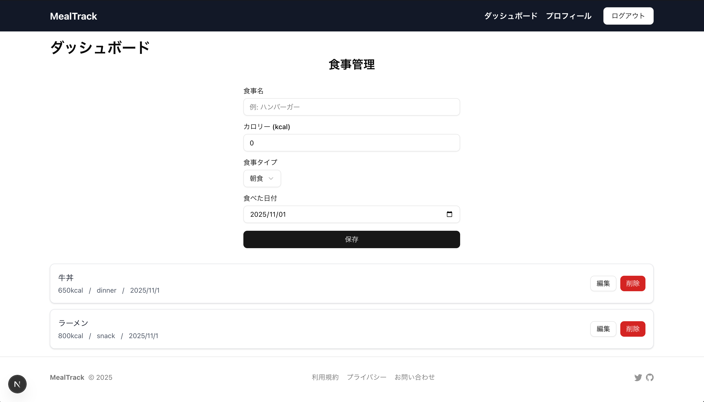

# MealTrack - 食事記録・体重管理アプリ

MealTrack は、日々の食事記録と体重管理をサポートするヘルスケアアプリケーションです。
ユーザーが食事を記録し、栄養バランスや体重の変化を追跡できるモダンな Web アプリケーションとして開発しています。

## 📋 プロジェクト概要

- **目的**: 健康的な食生活をサポートするための食事記録・体重管理アプリ
- **開発開始日**: 2025 年 10 月 11 日
- **ステータス**: 開発中

## 🛠️ 技術スタック

### フロントエンド

- **Framework**: Next.js 15 (App Router)
- **UI Library**: React 19
- **Language**: TypeScript
- **Styling**: Tailwind CSS
- **UI Components**: Radix UI

### バックエンド

- **Authentication**: Better Auth
- **Database**: PostgreSQL (Supabase)
- **ORM**: Drizzle ORM
- **Validation**: Zod

### インフラ・デプロイ

- **Hosting**: Vercel
- **Database**: Supabase

### 開発ツール

- **Linting**: ESLint
- **Type Checking**: TypeScript (strict mode)
- **Version Control**: Git (Conventional Commits)

## 🚀 セットアップ

### 必要な環境

- Node.js 18.0.0 以上
- npm / yarn / pnpm / bun

### インストール手順

```bash
# 依存関係のインストール
npm install

# 開発サーバーの起動
npm run dev

# ビルド
npm run build

# 本番環境の起動
npm start
```

開発サーバーは [http://localhost:3000](http://localhost:3000) で起動します。

## 📅 開発ログ

### 2025 年 10 月 11 日

- **実装内容**: プロジェクト初期セットアップ
  - Next.js 15 + React 19 プロジェクト作成
  - Better Auth による認証システム構築
  - Supabase + Drizzle ORM によるデータベースセットアップ
  - 基本的な食事記録 CRUD 機能の実装
- **学んだこと**:
  - Next.js 15 の App Router の新機能を理解
  - Better Auth による認証フローの構築方法を習得
  - Drizzle ORM のマイグレーション管理方法を学習
- ## **技術的な課題・解決策**:
- ## **次回の予定**:

---

### 2025 年 11 月 1 日

- **実装内容**: 日付毎のトータルカロリー数表示のための API を作成
  - `/api/meal/today` エンドポイントを作成
  - `profile` テーブルのマイグレーションを作成（ユーザープロファイルとカロリー目標の保存）
- **学んだこと**:
  - Drizzle ORM の `sum` 集約関数
  - 日付範囲の指定で使用した `gte`（以上）と `lt`（未満）の仕様
- **技術的な課題・解決策**:
  - `setHours(0, 0, 0, 0)` を使用して日付を指定し、`gte` と `lt` の組み合わせで 1 日の定義をしたが、タイムゾーンのズレで前日の日付が出力されてしまう課題が残った。
    日本に合わせた日付に修正するためタイムゾーンの仕様とデータベースのタイムゾーンを調べて対処してみる。
- **次回の予定**:
  - `/api/goal/calorie` の POST メソッドの実装完了（データベースへの保存処理）
  - カロリー目標をダッシュボードで表示と目標設定の入力をする機能の実装

---

### 2025 年 11 月 2 日

- **実装内容**: `/api/meal/today` エンドポイントのタイムゾーン対応を実装
  - `date-fns-tz` を使用して日本時間（JST）での日付計算に修正
  - データベース比較は UTC、表示は日本時間で処理するように変更
- **学んだこと**:
  - `date-fns-tz` の`fromZonedTime`（タイムゾーン → UTC）、`toZonedTime`（UTC → タイムゾーン）今回なら Asia/Tokyo
  - supabase 側の timezone を Asia/Tokyo に変更（参考：https://qiita.com/7mpy/items/bedd102355a51e93a7df）
- ## **技術的な課題・解決策**:
- ## **次回の予定**:
  -

---

## 📸 スクリーンショット

[]

## 🔗 リンク

- **デモサイト**:
- **GitHub**: https://github.com/s-hayashi123/portfolio_2025_10_11_mealtrack
